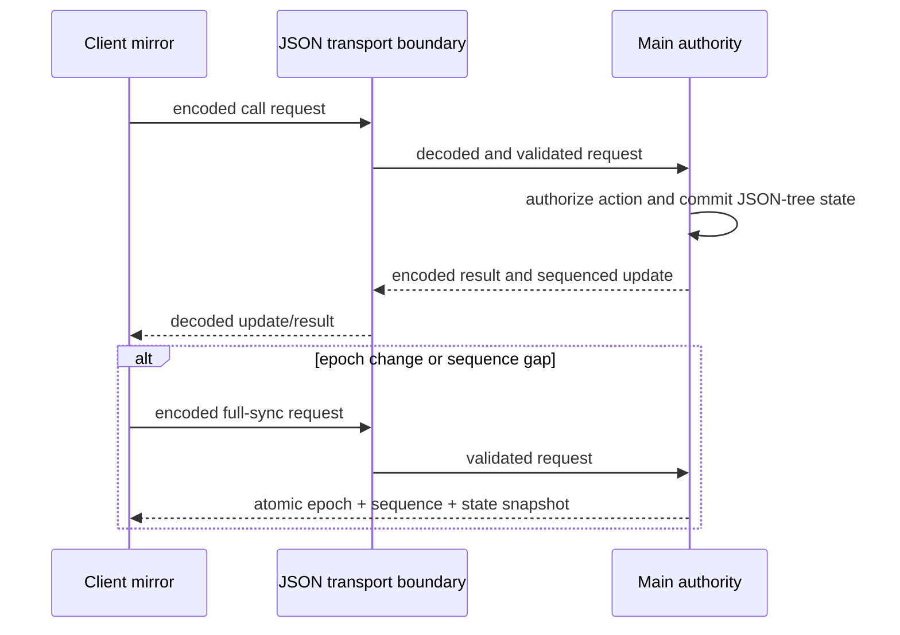

## Background & goals

The shared runtime must remain safe under malformed transport input and correct
across reconnects without forcing local-store consumers to load rich-state or
adapter machinery.

Goals:

- define one lossless JSON-tree contract for every transported value;
- preserve single-authority execution and deterministic client convergence;
- make local, shared, and adapter capabilities statically separable;
- reject unsupported values before JSON encoding can silently normalize them;
- restore a small, measurable default runtime.

## Non-goals

- preserving object identity or graph aliases across threads;
- transporting platform objects such as `Map`, `Set`, `Date`, URL objects, or
  binary buffers;
- treating application-supplied policy callbacks as a sandbox boundary;
- implementing per-client projected patch streams in the default runtime;
- retaining undocumented non-JSON transport behavior for a minor release.

## System behavior

What this shows: only encoded JSON crosses the trust boundary; the main runtime
is the sole authority and a client recovers discontinuities through an atomic
full sync.

## System rules

- Transported values MUST be JSON primitives, dense arrays, or plain records.
- Numbers MUST be finite and MUST preserve their JSON round trip; negative zero
  is unsupported.
- Transported containers MUST contain only own enumerable string-keyed data
  properties.
- Symbols, functions, accessors, custom `toJSON`, sparse arrays, dangerous path
  keys, cycles, and repeated references MUST be rejected before encoding.
- Incoming transport data MUST be parsed from the protocol's encoded form before
  application code can observe it.
- Remote action execution MUST be limited to action paths declared by the
  authoritative store and further restricted by configured authorization.
- Every update MUST carry an authority epoch and a non-negative safe-integer
  sequence.
- A client MUST apply only the next contiguous update for its active epoch.
- A sequence gap, unknown epoch, or invalid update MUST trigger full sync rather
  than partial recovery.
- Full sync MUST snapshot state, epoch, and sequence atomically.
- Unsafe or malformed patches MUST fail before any state is committed.
- Destroyed stores MUST reject new work and release transport listeners and
  pending waiters.

## Permission rules

- The main store is the only mutation authority.
- A client may read mirrored state and request an allowed action; it may not
  directly commit state or patches.
- Authorization hooks run in the main runtime and are trusted application code.
  Their boolean result controls the request; they are not treated as an object
  sandbox.
- Caught execute errors are redacted to a generic client message by default.
  Applications may expose an explicitly safe message through
  `transportPolicy.mapError`; thrown messages are otherwise authority-local.

## Technical design

- A small JSON codec owns validation, encoding, and decoding. Transport-specific
  payload limits remain the responsibility of the selected transport because a
  universal library limit would reject valid application snapshots arbitrarily.
- The wire protocol uses versioned tagged messages represented as JSON strings.
- Local creation, shared authority/client creation, and adapter integration use
  static entry points. The public signatures remain code-owned.
- Shared patch processing validates operation, path, and JSON value without
  graph-topology comparison.
- Rich-state and adapter behavior may exist only behind explicit extension
  boundaries and independent size budgets.

## Compatibility strategy

Coaction 3.0 is a major-version change. Existing 2.x behavior remains available from
the archived implementation history while the new main line establishes the
new contract. Migration documentation MUST explain how to replace non-JSON
state with plain data or an explicit local-only extension.

## Test strategy

The required layers and race cases are defined in
[test-plan.md](test-plan.md). Unit tests are necessary but insufficient: the
release gate also includes package entry-point checks, consumer bundle builds,
peer compatibility, Node integration, and browser worker smoke tests.

## Rollout & rollback

See [rollout.md](rollout.md). No release is allowed until the major changeset,
migration path, independent size budgets, and full verification matrix are
present.

## Monitoring & alerts

Coaction is a library rather than an operated service. Release monitoring is
therefore based on CI gates, package artifact inspection, consumer bundle
budgets, prerelease feedback, and rollback to the last 2.x release rather than
service dashboards.

## Reviewer focus

- JSON validation must reject lossy values before serialization.
- Transport simplification must not weaken authorization or patch-path safety.
- Listener registration, epoch transitions, and full-sync ordering require
  explicit race tests.
- A lean entry point must be demonstrated by a consumer bundle, not inferred
  from source-file layout.
- Adapter and rich-state imports must not leak into the default local entry.

## Agent constraints

- MUST preserve the archived pre-refactor branch.
- MUST NOT make production authorization or convergence checks development-only.
- MUST remove unsupported rich behavior and its promises instead of retaining
  unreachable compatibility branches in the default bundle.
- MUST update tests and docs in the same change as each contract boundary.
- MUST NOT raise a size budget without a measured, reviewed behavior change.

## Verification

- Contract rules: [test-plan.md](test-plan.md).
- Architecture decision: [ADR-0001](../../adr/0001-json-only-shared-runtime.md).
- Core behavior: `pnpm --filter coaction test`.
- Full workspace, package, and example release checks: `pnpm check`.
- Instrumented coverage report: `pnpm test:coverage`.
- Real Worker and SharedWorker transports: `pnpm test:e2e:browser`.
- Static consumer gates: `node scripts/check-core-entry-isolation.mjs`.
- Package artifacts and budgets: `pnpm build && pnpm package:size`.
- Major release metadata: `ALLOW_MAJOR_RELEASE=1 pnpm changeset:check`.
